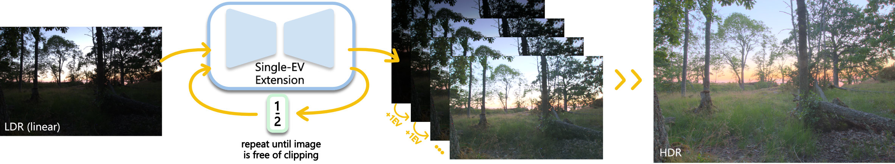
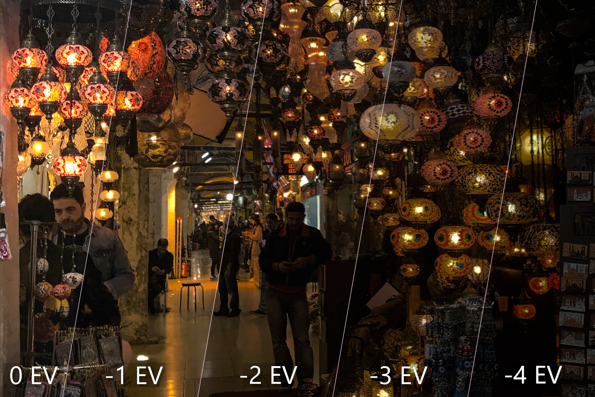

---

<div align="center">    
 
# Recurrent Dynamic Range Extension  
<i>Proc. SIGGRAPH Asia, 2026<br>
Patent pending</i>

[](https://yaksoy.github.io/RecurrentHDR/)
[](https://yaksoy.github.io/papers/SigAsia26-RecurrentHDR.pdf)
[](https://yaksoy.github.io/papers/SigAsia26-RecurrentHDR-supp.pdf)
[](https://colab.research.google.com/github/compphoto/RecurrentHDR/blob/main/notebooks/recurrentHDR_inference.ipynb)  


</div>
 


## Description   

We present an approach to progressively extend the highlights of an image.




Instead of reconstructing the full dynamic range of a complex scene directly,
we learn a simpler task first:<br>
We extend the dynamic range of an input image by a single exposure value.
Once this is mastered, we retrieve the full HDR image for the scene by executing
our network recurrently, progressively increasing the dynamic range of the input.
Our formulation is agnostic to the input dynamic range and targets a bounded output domain.
This enables us to use widely available RAW images for the reconstruction task and adapt
adversarial losses to construct realistic images.

                        



By incorporating Memory Replay for backpropagation, we can train our network recurrently
over multiple inference stages and reduce reconstruction errors.
As a consequence, our system reconstructs challenging long-tailed HDR scenes robustly
and shows powerful recovery of bright light sources and highlights.


Try out our pipeline on your own images in Colab! [](https://colab.research.google.com/github/compphoto/RecurrentHDR/blob/main/notebooks/recurrentHDR_inference.ipynb)

## How to run   
First, install dependencies. The code was tested with Python 3.9. It is recommended to start with a fresh environment:
```bash
# create empty env
python3 -m venv rhdr

# activate env
source rhdr/bin/activate
```
Next, clone this repository and install the requirements. Make sure that pip is up-to-date (python3 -m pip install --upgrade pip):

```bash
# clone project   
git clone https://github.com/compphoto/RecurrentHDR

# install project   
cd RecurrentHDR
pip install .
 ```   
 Now, run our HDR reconstruction pipeline. The results will be saved as EXR files in --output_path:  
 ```bash
# run module, e.g.  
python3 inference.py \
--input_path /path/to/input/imgs \
--result_path /path/to/results
```


### Licence
The methodology presented in this work is safeguarded under intellectual property protection. For inquiries regarding licensing opportunities, kindly reach out to SFU Technology Licensing Office <tlo_dir ατ sfu δøτ ca> and Dr. Yağız Aksoy <yagiz ατ sfu δøτ ca>.


### Citation
Please cite our paper if you use this code or any of the models.   
```
@INPROCEEDINGS{dilleRecurrentHDR,
author={Sebastian Dille and Keru Fu and S. Mahdi H. Miangoleh and Ya\u{g}{\i}z Aksoy},
title={Recurrent Dynamic Range Extension},
booktitle={Proc. SIGGRAPH Asia},
year={2026},
} 
```   

### Credits
".src/model/" is adapted from [MiDaS](https://github.com/intel-isl/MiDaS/tree/v2) for their ResNet implementation.<br>
".src/model/pix2pixhd" is adapted from [Pix2PixHD](https://github.com/NVIDIA/pix2pixHD) for their Discriminator.
